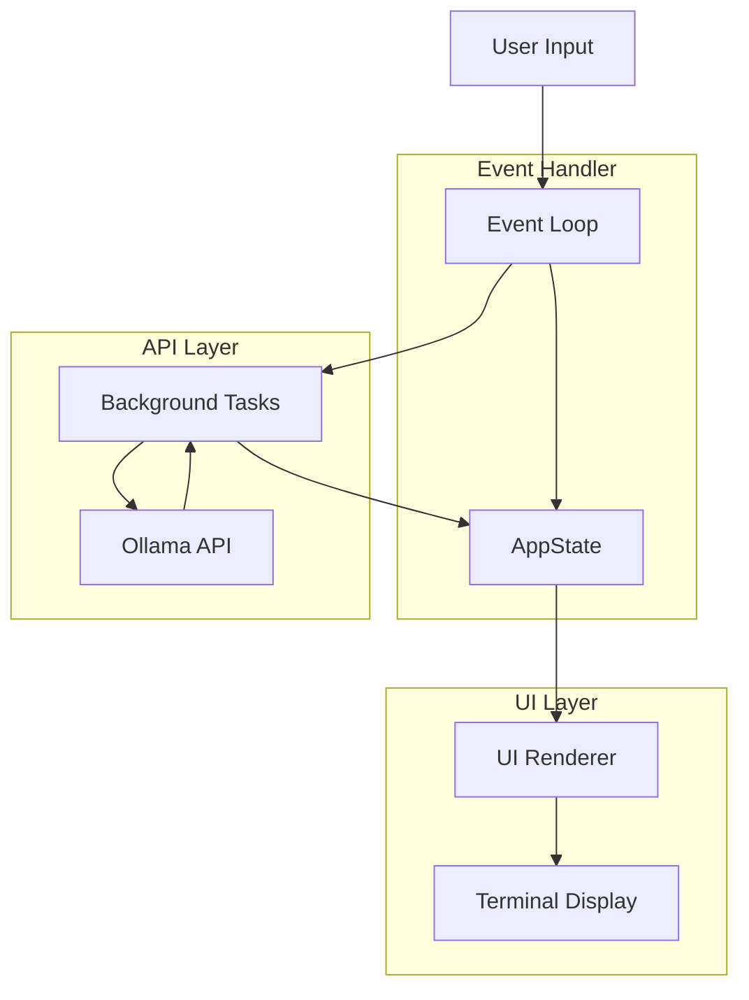

# LazyOllama - Easy llama, easy life


A terminal user interface (TUI) application for managing local Ollama models, written in Rust.

https://github.com/user-attachments/assets/5fcdb0eb-c398-4662-aed9-4fd8359d7063

## Features

*   **List Models:** Displays a scrollable list of locally installed Ollama models.
*   **Search & Filter Models:** Real-time search and filtering of installed models using `/` key.
*   **Run Models:** Run any of the locally installed Ollama models.
*   **Inspect Models:** Shows detailed information for the selected model (size, modification date, digest, family, parameters, etc.).
*   **Delete Models:** Allows deleting the selected model with a confirmation prompt.
*   **Install Models:** Allows to pull new models from the ollama registry with search and filter capabilities.
*   **Registry Search:** Search and filter through available models in the Ollama registry during installation.
*   **Environment Variable:** Uses `OLLAMA_HOST` environment variable for the Ollama API endpoint (defaults to `http://localhost:11434`).

## Installation

### Prerequisites

*   Rust toolchain (Install from [rustup.rs](https://rustup.rs/))
*   A running Ollama instance ([ollama.com](https://ollama.com/))
*   Homebrew (macOS / Linux) ([brew.sh](https://brew.sh/))

### Method 1: Homebrew (macOS / Linux) (Recommended)

Install using the official Homebrew tap.

**Option 1 (Tap first, then install):**

```bash
# Add the custom tap
brew tap webmatze/tap

# Install the tool
brew install lazyollama
```

**Option 2 (Direct install):**

Homebrew can automatically tap and install in one step if you provide the full formula name:

```bash
brew install webmatze/tap/lazyollama
```

**Upgrading:**

To upgrade to the latest version:

```bash
# Update Homebrew and all formulas (including lazyollama)
brew update
brew upgrade lazyollama
```

### Method 2: Using the Installation Script

This is the simplest way to build and install LazyOllama to a system-wide location:

```bash
# 1. Clone the repository
git clone https://github.com/webmatze/lazyollama.git
cd lazyollama

# 2. Run the installation script
chmod +x install.sh
./install.sh
```

The script will:
- Check for required dependencies
- Build the release version
- Install it to the appropriate location for your OS (typically `/usr/local/bin` on Unix-like systems)
- Set appropriate permissions

### Method 3: Using Cargo Install

If you have Rust installed, you can install directly using Cargo:

```bash
# 1. Clone the repository
git clone https://github.com/webmatze/lazyollama.git
cd lazyollama

# 2. Install using cargo
cargo install --path .
```

This will install the binary to your Cargo bin directory (typically `~/.cargo/bin/`), which should be in your PATH.

### Method 4: Manual Build and Installation

If you prefer to manually build and place the binary:

```bash
# 1. Clone the repository
git clone https://github.com/webmatze/lazyollama.git
cd lazyollama

# 2. Build the application
cargo build --release

# 3. Copy the binary to a location in your PATH (optional)
# On Linux/macOS (may require sudo)
sudo cp target/release/lazyollama /usr/local/bin/
```

The executable will be located at `target/release/lazyollama`.

### Platform-Specific Considerations

- **Linux/macOS**: Installation to system directories (like `/usr/local/bin`) typically requires root privileges (sudo).
- **Windows**: The installation script will attempt to install to an appropriate location, but you may need to adjust your PATH environment variable.

### Verifying Installation

After installation, verify that lazyollama is correctly installed and accessible:

```bash
# Check if the command is available
which lazyollama

# Run lazyollama
lazyollama
```

If the command isn't found, ensure the installation location is in your PATH.

## Usage

1.  **Run the application:**
    ```bash
    lazyollama
    ```
2.  **Set Custom Ollama Host (Optional):**
    If your Ollama instance is running on a different host or port, set the `OLLAMA_HOST` environment variable before running:
    ```bash
    export OLLAMA_HOST="http://your-ollama-host:port"
    lazyollama
    ```

## Keybindings

### General
*   `q`: Quit the application.
*   `h` / `?`: Show/Hide help screen.

### Model List Navigation
*   `↓` / `j`: Move selection down.
*   `↑` / `k`: Move selection up.
*   `Enter`: Run selected model in ollama.
*   `d`: Initiate deletion of the selected model (shows confirmation).

### Search & Filter (Local Models)
*   `/`: Enter filter mode to search through installed models.
*   `Ctrl+C`: Clear current filter.

### Filter Mode Controls
*   `Type`: Enter search text to filter models in real-time.
*   `Backspace`: Remove characters from search.
*   `←` / `→`: Move cursor within search input.
*   `Enter`: Confirm filter and return to model list.
*   `Esc`: Cancel filter and clear search.

### Model Installation
*   `i`: Open install dialog to browse and install new models from registry.
*   `/`: (During install) Filter available registry models.
*   `Ctrl+C`: (During install) Clear registry filter.

### Confirmation Dialogs
*   `y` / `Y`: Confirm action (delete, install, etc.).
*   `n` / `N` / `Esc`: Cancel action or go back.

## Search & Filter Features

### Local Model Filtering
LazyOllama provides powerful search capabilities for your installed models:

1. **Quick Search**: Press `/` from the main model list to enter filter mode
2. **Real-time Filtering**: Type to instantly filter models as you type
3. **Case-insensitive**: Search works regardless of capitalization
4. **Partial Matching**: Find models by typing any part of their name
5. **Visual Feedback**: See filtered count in the title bar (e.g., "Models (filtered: 3/10)")

**Example**: Type "llama" to show only models containing "llama" in their name.

### Registry Model Search
When installing new models (`i` key), you can also search through available models:

1. **Browse Registry**: Press `i` to see all available models from Ollama registry
2. **Filter Registry**: Press `/` within the install dialog to filter available models  
3. **Find Models Fast**: Quickly locate specific models from hundreds of available options
4. **Smart Filtering**: Same real-time, case-insensitive search as local models

**Example**: In install mode, type "code" to find all code-related models like "codellama", "codegemma", etc.

### Filter Controls
Both local and registry filters support the same intuitive controls:
- **Arrow keys** or **mouse**: Position cursor anywhere in search text
- **Backspace**: Delete characters before cursor
- **Ctrl+C**: Instantly clear current filter
- **Enter**: Apply filter and return to browsing
- **Esc**: Cancel and clear filter

## Dependencies

This project uses the following main Rust crates:

*   `ratatui`: For building the TUI.
*   `crossterm`: Terminal manipulation backend for `ratatui`.
*   `tokio`: Asynchronous runtime.
*   `reqwest`: HTTP client for interacting with the Ollama API.
*   `serde`: For serializing/deserializing API data.
*   `humansize`: For formatting file sizes.
*   `thiserror`: For error handling boilerplate.
*   `dotenvy`: (Optional) For loading `.env` files if needed.

See `Cargo.toml` for the full list and specific versions.

## Architecture Overview

The application follows a simple event loop architecture:

1.  **Initialization:** Sets up the terminal, initializes `AppState`, and fetches the initial list of models from the Ollama API.
2.  **Event Loop:**
    *   Draws the UI based on the current `AppState`.
    *   Checks for user input (keyboard events) and results from background tasks (via channels).
    *   Handles input: Updates `AppState` (e.g., changes selection, enters delete mode, quits).
    *   Handles background task results (e.g., updates model details).
    *   Triggers background tasks (e.g., fetching model details) when necessary.
3.  **Cleanup:** Restores the terminal state on exit.

## Architecture Diagram



## Troubleshooting

*   **Connection Errors:** Ensure your Ollama instance is running and accessible at the specified `OLLAMA_HOST` (or the default `http://localhost:11434`). Check firewalls if necessary.
*   **API Errors:** If the Ollama API returns errors, they should be displayed in the status bar. Refer to the Ollama server logs for more details.
*   **Rendering Issues:** Terminal rendering can vary. Ensure you are using a modern terminal emulator with good Unicode and color support.
