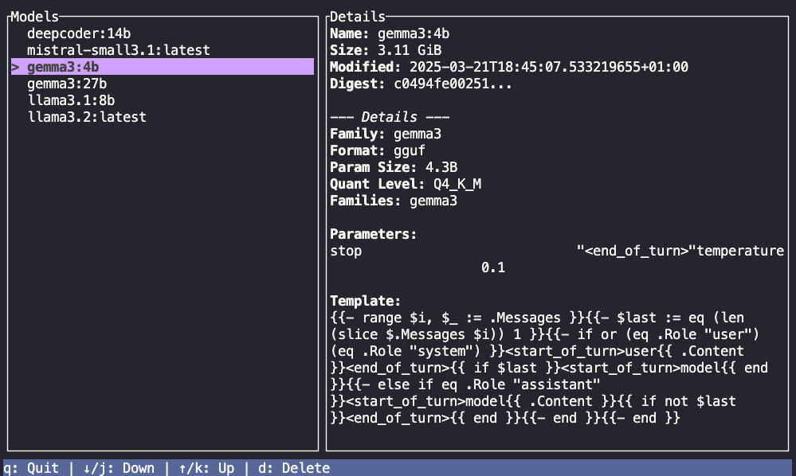
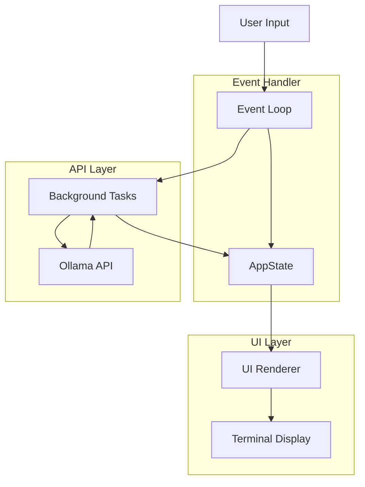

# lazyollama - A Ollama TUI

A terminal user interface (TUI) application for managing local Ollama models, written in Rust.



## Features

*   **List Models:** Displays a scrollable list of locally installed Ollama models.
*   **Inspect Models:** Shows detailed information for the selected model (size, modification date, digest, family, parameters, etc.).
*   **Delete Models:** Allows deleting the selected model with a confirmation prompt.
*   **Install Models:** Allows to pull new models from the ollama registry.
*   **Environment Variable:** Uses `OLLAMA_HOST` environment variable for the Ollama API endpoint (defaults to `http://localhost:11434`).

## Installation

1.  **Prerequisites:**
    *   Rust toolchain (Install from [rustup.rs](https://rustup.rs/))
    *   A running Ollama instance ([ollama.com](https://ollama.com/))
2.  **Clone the repository:**
    ```bash
    git clone https://github.com/webmatze/lazyollama.git
    cd lazyollama
    ```
3.  **Build the application:**
    ```bash
    cargo build --release
    ```
    The executable will be located at `target/release/lazyollama`.

## Usage

1.  **Run the application:**
    ```bash
    ./target/release/lazyollama
    ```
2.  **Set Custom Ollama Host (Optional):**
    If your Ollama instance is running on a different host or port, set the `OLLAMA_HOST` environment variable before running:
    ```bash
    export OLLAMA_HOST="http://your-ollama-host:port"
    ./target/release/lazyollama
    ```

## Keybindings

*   `q`: Quit the application.
*   `↓` / `j`: Move selection down.
*   `↑` / `k`: Move selection up.
*   `d`: Initiate deletion of the selected model (shows confirmation).
*   `y` / `Y`: Confirm deletion (when in confirmation mode).
*   `n` / `N` / `Esc`: Cancel deletion (when in confirmation mode).
*   `i`: Install/Pull new models

## Dependencies

This project uses the following main Rust crates:

*   `ratatui`: For building the TUI.
*   `crossterm`: Terminal manipulation backend for `ratatui`.
*   `tokio`: Asynchronous runtime.
*   `reqwest`: HTTP client for interacting with the Ollama API.
*   `serde`: For serializing/deserializing API data.
*   `humansize`: For formatting file sizes.
*   `thiserror`: For error handling boilerplate.
*   `dotenvy`: (Optional) For loading `.env` files if needed.

See `Cargo.toml` for the full list and specific versions.

## Architecture Overview

The application follows a simple event loop architecture:

1.  **Initialization:** Sets up the terminal, initializes `AppState`, and fetches the initial list of models from the Ollama API.
2.  **Event Loop:**
    *   Draws the UI based on the current `AppState`.
    *   Checks for user input (keyboard events) and results from background tasks (via channels).
    *   Handles input: Updates `AppState` (e.g., changes selection, enters delete mode, quits).
    *   Handles background task results (e.g., updates model details).
    *   Triggers background tasks (e.g., fetching model details) when necessary.
3.  **Cleanup:** Restores the terminal state on exit.

## Architecture Diagram



## Troubleshooting

*   **Connection Errors:** Ensure your Ollama instance is running and accessible at the specified `OLLAMA_HOST` (or the default `http://localhost:11434`). Check firewalls if necessary.
*   **API Errors:** If the Ollama API returns errors, they should be displayed in the status bar. Refer to the Ollama server logs for more details.
*   **Rendering Issues:** Terminal rendering can vary. Ensure you are using a modern terminal emulator with good Unicode and color support.
